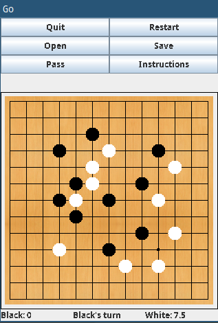

Go
=======================

An implementation of the Go board game using Java Swing. The rules of Go are implemented fully except
for the `ko rule`, which has partial support.

### Implementation Details
  1. **Representation:** A 2d array is used to represent the gameboard. The 2d array is 
  contained inside a `StoneArray` object. The elements of the 2d array are objects of the `Stone`
  class which is an extension of the `GameObj` class. The `Stone` objects maintain information about
  their positions on the board and their state (`EMPTY`, `BLACK`, `WHITE`). By default, the `StoneArray`
  object is initialized with `EMPTY` states for all `Stone` objects.

  2. **Save and Load:** The game state can be saved or restored from
  a previously saved file. The complete state of the saved game is contained in the savedGame.txt file
  whose first line is the number of points black had, second line is the number of points white had, 3-15
  lines are a string representation of the saved StoneArray (0 for empty, 1 for white, 2 for black), and
  the line 16 is the player whose turn it is (1 for white, 2 for black).

  3. **Recursive capture:** In Go, a group of stones of one player is captured (removed from the board) if 
  each of them is surrounded on all four side by other stones. This is implemented through a recursive
  method. The recursive method, for the position it is applied on, checks whether the stone has
  any empty sides and returns true if it does. Otherwise it recurses onto stones surrounding it of the
  same type that have not been previously checked and performs an OR operation on the results and returns
  this. Ultimately, the method checks whether any of the stones of a group have an empty intersection.

  A Set structure is used for the recursive method. The recursive method must not call
  on the same stones continuously to prevent an infinite loop. So, the method is called with a Set object
  that keeps track of all of the stones that the method has been applied to.

#### Classes
The enum Player represents the possible Players (Black or White).
The enum Stone represents the possible state of a Stone (Black, White, or Empty).
The enum InvalidMove represents the possible moves that are not allowed as well as 
	errors or warnings that can be displayed.
The Game object is the same as the original with a few added buttons and an additional
	instructions frame.
The GameBoard is the background of the Go Board.
The GameCourt is contains most of the logic operations outside of StoneArray as well
	as I/O and Clicking functionality
The GameObj class is the same as original with the unnecessary velocity values removed.
The Stone class represents each of the stone objects which are gameObjects that know
	their state.
The StoneArray class contains all of the Stone objects in a 2D array and acts as an 
	intermediary between GameCourt and the Stones. Its methods can alter the state of
	the 2D array and contains most of the logic operations (especially the more complex
	ones like checking for the validity of a placement).

#### Challenges
	The game logic, specifically the recursive algorithm and the associated removal feature
	are the most challenging aspect to implement. This requiras the methods to create additional StoneArray
	objects to simulate possible changes to the game and whether a move would be legal.

<!--
- Evaluate your design. Is there a good separation of functionality? How well is
  private state encapsulated? What would you refactor, if given the chance?
	I think that generally the functionality is distributed reasonably between the StoneArray
	and the GameCourt classes. The Stone objects are completely encapsulated within
	StoneArray and no internal values for any of the classes are directly accessible. If
	given the chance, I would rewrite more of the original code that was given and would
	replace the x and y values with more Point objects that are more straightforward to use. 
-->
